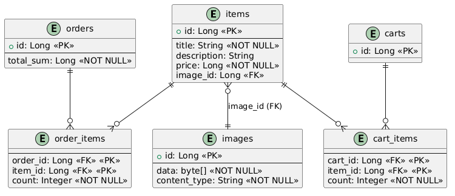
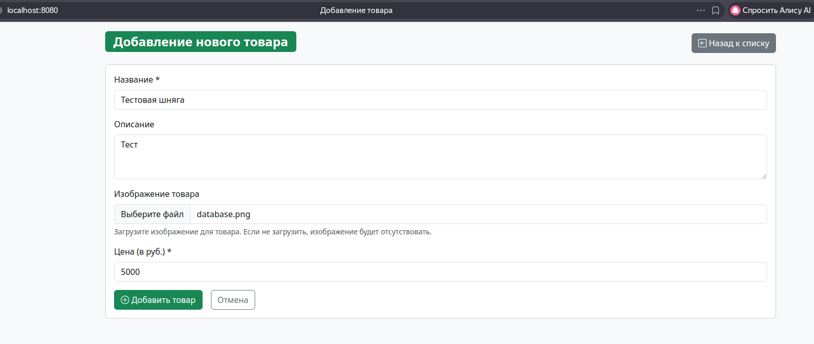
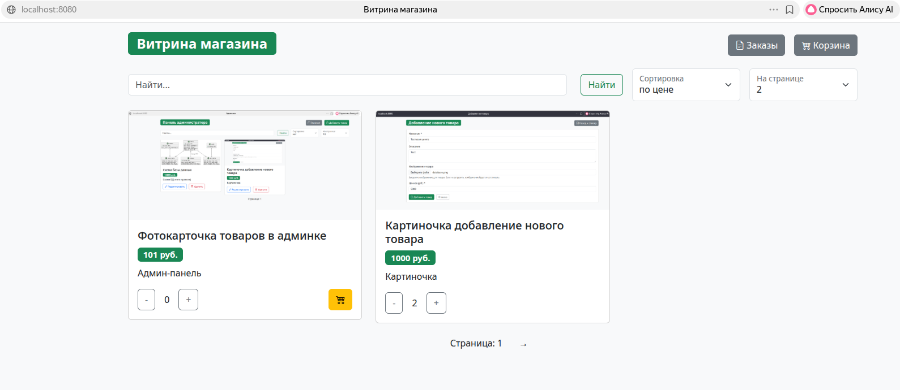
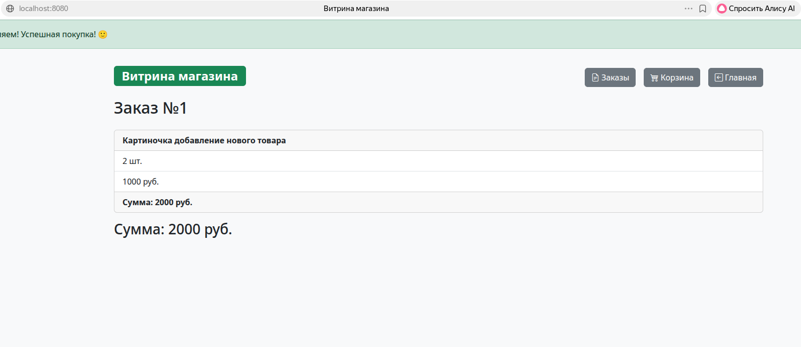

# Market App

## Преамбула

Это backend-приложение для интернет-магазина, реализованное на Java с использованием Spring Framework и реактивного стэка.
В приложении есть UI из шаблонов, веб-интерфейс для управления товарами, корзиной, заказами и изображениями, админ-панель.

## Технологический стек

- Java 21
- Spring Boot 4.0.3
  - WebFlux
  - Data R2DBC
  - Liquibase
- PostgreSQL
- Redis
- Thymeleaf
- Docker
Тесты:
- JUnit 5
- Mockito
- Testcontainers
- WireMock

## Взаимодействие сервисов

Приложение состоит из двух независимых сервисов:

- **store** – основной сервис маркетплейса (порт 8080). Обрабатывает UI, каталог товаров, корзину и заказы.
- **payment** – сервис оплаты (порт 8081). Принимает запросы на проведение платежей и взаимодействует с внешними платёжными шлюзами. Имеет внутри фиксированный заданный в application.yml баланс для пользователя. Нужен для совершения оплаты и хранения данных о балансе.

### Конфигурация взаимодействия

- `PAYMENT_SERVICE_URL` – URL сервиса оплаты (по умолчанию `http://payment:8081`).

## Архитектура приложения
### store
Приложение разбито на слои:

- `config` – конфигурация
- `service` – сервисы для бизнес-логики
- `repository` – репозитории для работы с базой данных (Spring Data JPA)
- `domain` – сущности базы данных
- `mapper` – мапперы для преобразования DTO
- `utils` – утилиты, константы
- `web/controller` – контроллеры для обработки HTTP‑запросов и отображения веб-страниц
- `web/dto` – DTO для передачи данных

БД: PostgreSQL.
Миграции управляются через Liquibase (`store/src/main/resources/db/changelog/`).
Есть тестовые данные ('src/test/resources/db/changelog/db.changelog-901-test-data.xml'), было принято их наименовать с 901 номера.
Кэш: redis.

Для проведения платежей использует payment-service.

### payment
Приложение разбито на слои:

- `service` – сервисы для бизнес-логики
- `web` – контроллеры для обработки HTTP‑запросов и отображения веб-страниц
- `config` – конфигурация для более простого управления значениями

Не имеет БД/кэша. В application.yaml указан стартовый баланс.

## База данных:
База данных с небольшим заделом на будущее (например, вынос entity корзины в отдельную БД, хоть и не требуется в данный момент. В будущем может быть использована для привязки корзины к пользователю или чтобы поделиться корзиной):


## Функциональность

### Веб-интерфейс

- **Главная страница (/items)** – просмотр товаров с поиском, сортировкой и пагинацией.
- **Страница товара (/items/{id})** – детальная информация о товаре, добавление в корзину.
- **Корзина (/cart/items)** – просмотр и управление товарами в корзине (увеличение/уменьшение количества, удаление).
- **Заказы (/orders)** – список заказов пользователя.
- **Страница заказа (/orders/{id})** – детали заказа.
- **Админ-панель (/admin)** – управление товарами (создание, редактирование, удаление, загрузка изображений).

Пример интерфейса: *(больше можно увидеть в директории .images)*




### Endpoints

#### Товары
- `GET /`, `GET /items` – получение списка товаров с пагинацией, поиском и сортировкой
- `GET /items/{id}` – получение информации о конкретном товаре
- `POST /items` – действие с товаром (добавление в корзину)
- `POST /buy` – оформление заказа из корзины

#### Корзина
- `GET /cart/items` – просмотр корзины
- `POST /cart/items` – изменение количества товара в корзине

#### Заказы
- `GET /orders` – список заказов
- `GET /orders/{id}` – детали заказа

#### Администрирование
- `GET /admin` – страница управления товарами
- `GET /admin/items/new` – форма создания товара
- `POST /admin/items` – создание товара
- `GET /admin/items/{id}/edit` – форма редактирования товара
- `POST /admin/items/{id}` – обновление товара
- `POST /admin/items/{id}/delete` – удаление товара

#### Изображения
- `GET /items/{id}/image` – получение изображения товара

## Кеширование с Redis
### Что кешируется

- `item:card:{id}` – карточка товара, ru.devinvader.market.web.dto.ItemDto. TTL 10 мин.
- `item:list:v{version}:{searchHash}:{sortType.name()}:{page}:{size}` - результаты поиска. TTL 10 минут если search пустой, 1 минута если не пустой. Строка поиска переводится в `MD5 hex` хэш или `none` если поиска нет. Версия меняется если меняется любой товар в БД.

## Сборка и запуск

### Требования

- Java 21
- Maven 3.9+
- Docker и Docker Compose (для запуска в контейнерах)

### Сборка проекта (локально, справедливо для обоих сервисов)

```bash
mvn clean package
```

### Запуск с Docker Compose:

1. Сборка образов и запуск контейнеров:

```bash
docker compose build
docker compose up -d
```

2. Приложение Store (Маркет) будет доступно по адресу [http://localhost:8080/](http://localhost:8080/)
   Приложение Payment Service будет доступно по адресу [http://localhost:8081/](http://localhost:8081/)

3. Остановка контейнеров:

```bash
docker compose down
```

Для полного удаления с томами базы данных:

```bash
docker compose down -v
```

### Запуск без Docker

#### Предустановка
Нужен PostgreSQL на localhost:5432 с базой `market`, пользователем `postgres` и паролем `postgres`.
Нужен Redis на localhost:6379.
Или необходимо изменить настройки в `store/src/main/resources/application.yaml`.

#### Запуск
```bash
mvn spring-boot:run -pl store
```

Для Payment Service:
```bash
mvn spring-boot:run -pl payment
```

Либо запустить забилженные JAR:

```bash
java -jar store/target/store-0.0.1-SNAPSHOT.jar
java -jar payment/target/payment-0.0.1-SNAPSHOT.jar
```

## Конфигурация
### store
Основные настройки находятся в `store/src/main/resources/application.yaml`:

```yaml
spring:
  application:
    name: market
  r2dbc:
    url: ${SPRING_R2DBC_URL:r2dbc:postgresql://localhost:5432/market}
    username: ${SPRING_DATASOURCE_USERNAME:postgres}
    password: ${SPRING_DATASOURCE_PASSWORD:postgres}
  liquibase:
    enabled: true
    change-log: classpath:db/changelog/db.changelog-master.xml
    url: ${SPRING_LIQUIBASE_URL:jdbc:postgresql://localhost:5432/market}
    user: ${SPRING_DATASOURCE_USERNAME:postgres}
    password: ${SPRING_DATASOURCE_PASSWORD:postgres}
  data:
    redis:
      host: ${SPRING_DATA_REDIS_HOST:localhost}
      port: ${SPRING_DATA_REDIS_PORT:6379}

integration:
  payment-service:
    url: ${PAYMENT_SERVICE_URL:http://localhost:8081}
```

### payment
Основные настройки находятся в `payment/src/main/resources/application.yaml`:

```yaml
server:
  port: 8081

payment:
  initial-balance: 1000000

spring:
  application:
    name: payment-service
```

### Общая информация

В Docker-окружении параметры передаются через переменные среды (см. `docker-compose.yml`).

## Тестирование (справедливо для обоих сервисов)

Для запуска тестов:

```bash
mvn clean test
```

Интеграционные тесты используют Testcontainers для поднятия PostgreSQL/Redis в контейнере.